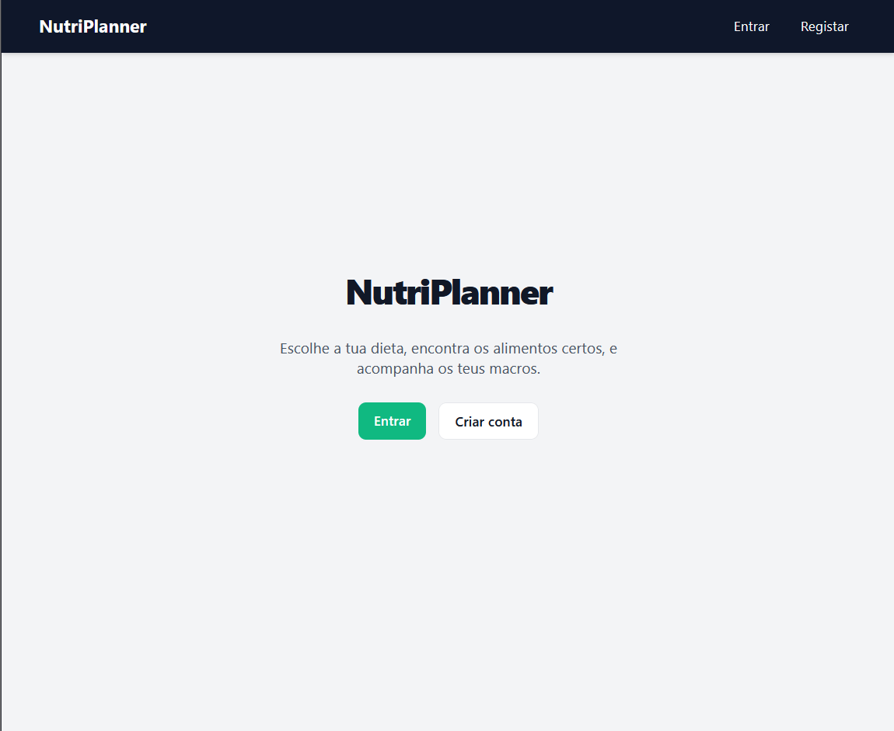
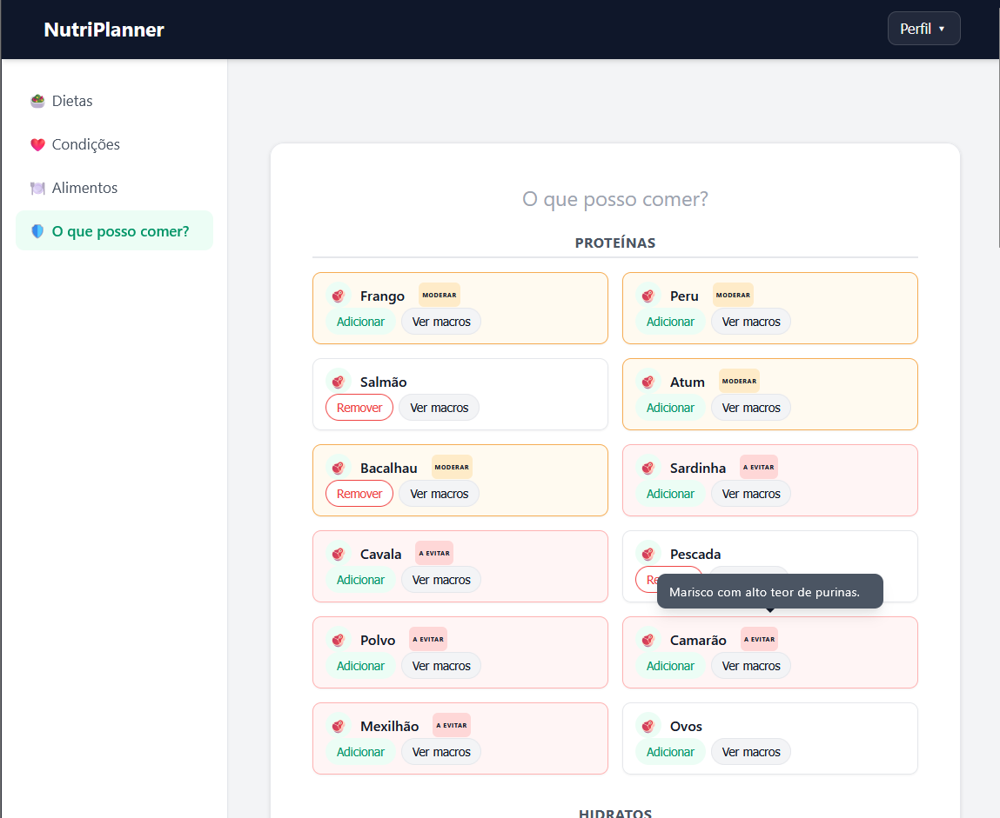
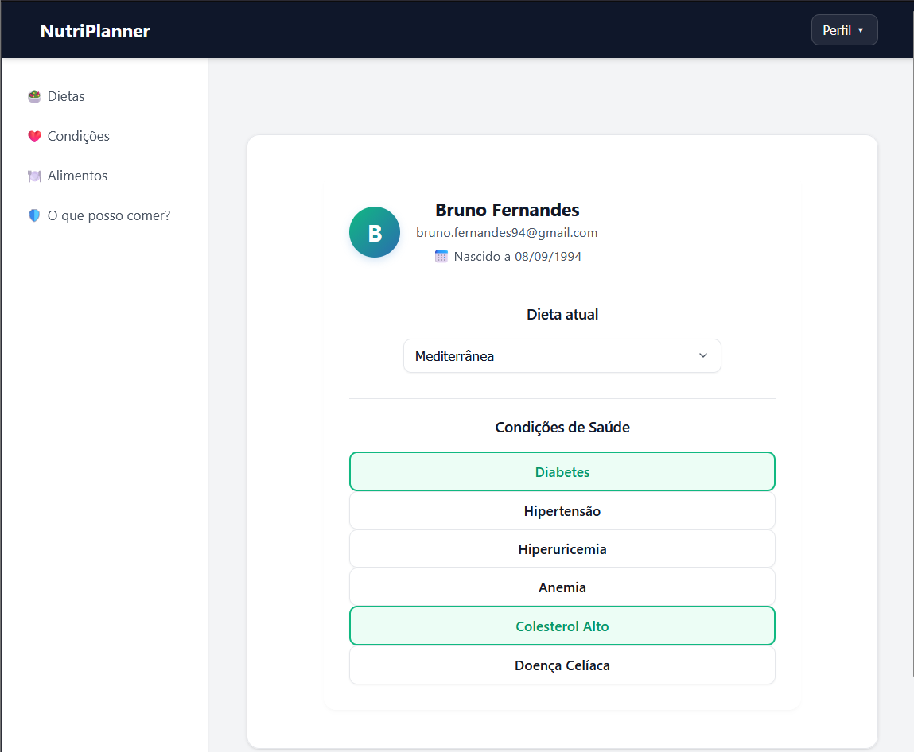

# 🥗 NutriPlanner
**NutriPlanner** is a web application designed to help users intelligently plan their nutrition by crossing specific dietary preferences with individual health restrictions and conditions.

### Screenshots

| Home Page             | Motor "What Can I Eat?" | Profile Page            |
| :-------------------: | :---------------------: | :---------------------: |
|  |  |  |

## 🚀 Tech Stack

### Backend
* **ASP.NET Core Web API (.NET)**

* **Entity Framework Core** (SQL Server)

* **ASP.NET Core Identity** (Authentication & User Management)

* **JWT Bearer Authentication**

### Frontend
* **React** (with Vite)

* **React Router** (Routing)

* **Modern CSS** (Clean, custom, and responsive design)

## ✨ Key Features

* **Secure Authentication:** JWT-based registration and login with strict password requirements and detailed user profiles.

* **Diet Management:** Select, update, or clear active dietary preferences (e.g., Vegan, Carnivore, etc.).

* **Health Conditions:** Link and manage medical conditions associated with the user profile (e.g., Diabetes, Hypertension, Celiac Disease).

* **Safe Foods Engine ("What Can I Eat?"):** Automatic cross-referencing between allowed diet foods and medical restrictions, categorizing foods into Safe, Moderate, or Avoid (complete with custom tooltips detailing the specific reasons).

## 📦 How to Run Locally

### Prerequisites

Make sure you have installed:

* [.NET SDK](https://dotnet.microsoft.com)

* [Node.js & npm](https://nodejs.org)

* SQL Server (or LocalDB)

### Backend Setup
1. Clone the repository and navigate to the API folder.
2. Configure your database connection string in appsettings.json or use User Secrets for sensitive data (like the JWT Key).
3. Run database migrations:
```bash
dotnet ef database update
```
     
4. Start the API:
```bash
dotnet run
```

### Frontend Setup
1. Navigate to the React project directory.
2. Install dependencies:
```bash
npm install
```
3. Start the development server:
```bash
npm run dev
```

## ⚠️ Health Disclaimer

The information provided by this application is for general informational and meal-planning purposes only. NutriPlanner does not replace professional medical advice, diagnosis, or treatment. Always consult a qualified physician or registered dietitian regarding any question or condition related to your health.